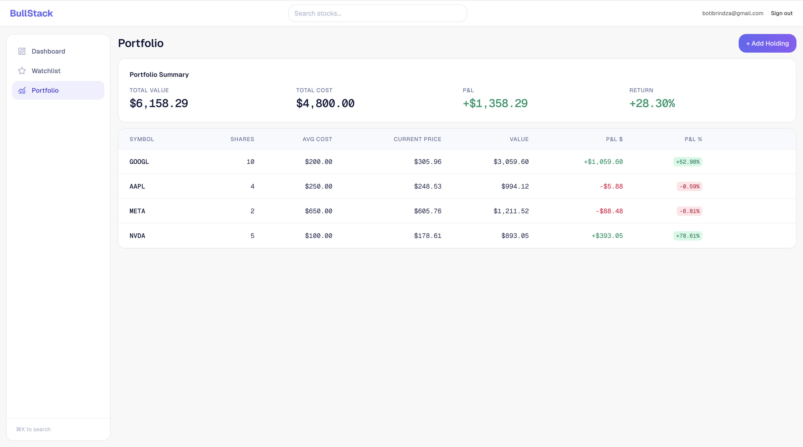
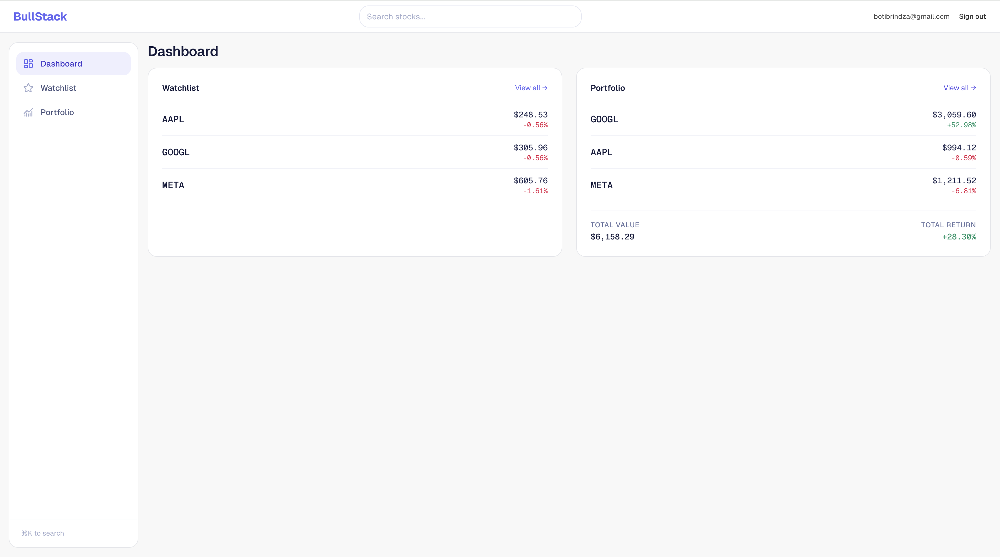
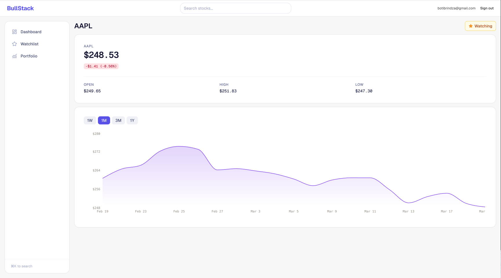

# BullStack

A personal finance dashboard for tracking stock watchlists and portfolios — built as a learning project with a full production-grade stack.




---

## Tech Stack

[](https://nextjs.org/)
[](https://www.typescriptlang.org/)
[](https://tailwindcss.com/)
[](https://railway.app/)
[](https://www.prisma.io/)
[](https://authjs.dev/)
[](https://finnhub.io/)
[](https://recharts.org/)
[](https://tanstack.com/query)
[](https://zod.dev/)
[](https://vercel.com/)

---

## Project Structure

```
bullstack/
├── app/
│   ├── (auth)/                    # Centered card layout — login, register
│   ├── (dashboard)/               # Protected pages — topbar layout
│   │   ├── dashboard/             # Overview: watchlist widget
│   │   ├── watchlist/             # Full watchlist with live quotes
│   │   ├── stocks/[symbol]/       # Chart, quote card, add to watchlist
│   │   ├── portfolio/             # Holdings table with P&L  [upcoming]
│   │   └── news/                  # Market news feed          [upcoming]
│   └── api/
│       ├── auth/[...nextauth]/
│       ├── watchlist/             # GET, POST; [symbol]/ DELETE
│       ├── portfolio/             # GET, POST; [id]/ PUT, DELETE [upcoming]
│       └── stocks/[symbol]/       # quote/, candles/, search/
├── components/
│   ├── auth/                      # LoginForm, RegisterForm
│   ├── stock/                     # StockSearchBar, StockQuoteCard, StockChart
│   ├── watchlist/                 # WatchlistTable, WatchlistWidget, AddToWatchlistButton
│   └── layout/                   # Topbar, UserMenu
├── lib/
│   ├── auth.ts                    # NextAuth v5 config
│   ├── prisma.ts                  # Prisma singleton (globalThis pattern)
│   ├── finnhub.ts                 # Finnhub API wrapper with in-memory cache
│   ├── yahoo.ts                   # yahoo-finance2 candles, normalized to Finnhub shape
│   ├── cache.ts                   # Map-based TTL cache utility
│   ├── api.ts                     # Client-side fetch wrappers
│   └── utils.ts                   # cn(), formatCurrency(), formatPercent()
├── hooks/
│   └── useWatchlist.ts            # React Query hook for watchlist CRUD
├── types/
│   ├── finnhub.ts
│   └── next-auth.d.ts
├── prisma/schema.prisma
└── middleware.ts                  # Route protection
```

---

## Getting Started

### Prerequisites

- Node.js 18+
- A PostgreSQL database (Railway recommended)
- Finnhub API key — [finnhub.io/dashboard](https://finnhub.io/dashboard)
- Google OAuth credentials (optional, for Google sign-in)

### Environment Variables

Create a `.env.local` file in the project root:

```env
DATABASE_URL=           # Railway PostgreSQL connection string
NEXTAUTH_URL=           # http://localhost:3000
NEXTAUTH_SECRET=        # openssl rand -base64 32
GOOGLE_CLIENT_ID=
GOOGLE_CLIENT_SECRET=
FINNHUB_API_KEY=
```

### Install and Run

```bash
pnpm install
npx prisma migrate dev --name init
pnpm dev
```

Open [http://localhost:3000](http://localhost:3000).

---

## Current Status

### Completed

**Phase 1 — Project Setup**
Scaffolded with Next.js 14 App Router, connected to Railway PostgreSQL, deployed to Vercel.

**Phase 2 — Authentication**
Email/password registration with Zod validation and bcryptjs hashing. Google OAuth via NextAuth v5. Server Actions for auth forms (no API routes for auth). Middleware protects all `/dashboard/*` routes.

**Phase 3 — Stock Data**
Live quotes via Finnhub (60s refresh). Historical candles via `yahoo-finance2` (normalized to Finnhub shape — Finnhub candles are premium-tier). Debounced symbol search autocomplete. Area chart with 1W / 1M / 3M / 1Y resolution switcher. All Finnhub calls are server-side only; the API key never reaches the browser.

**Phase 4 — Watchlist**
Users can add/remove stocks from a personal watchlist. Live quotes displayed in both a full table view and a dashboard widget. Mutations use optimistic updates via TanStack Query.

**UI Polish**
Custom design system applied — warm `surface-*` color palette, semantic `up`/`down` directional colors, `brand-*` amber accent. Monospace `tabular-nums` on all prices and stats. Sticky topbar with backdrop blur. `card`, `badge-up/down`, `btn-primary`, `input-base` utility classes throughout.

---

### Upcoming

**Phase 5 — Portfolio Tracking**
Holdings table (symbol, shares, avg cost, current price, value, P&L). `AddHoldingModal` with symbol picker. `PortfolioSummaryCard` with total value and return. Portfolio summary widget on dashboard.

**Phase 6 — News Feed**
Per-stock news on the stock detail page. General market headlines on dashboard and `/news`. 15-minute server-side cache.

**Phase 7 — Production Polish**
Loading skeletons, error boundaries, `<Suspense>` wrappers, mobile-responsive layout, end-to-end deploy validation.

---

## Architecture Notes

**Caching** — All external API calls are server-side, cached in-memory with TTL:

| Data | TTL |
|---|---|
| Quote | 60 s |
| Candles (intraday/weekly) | 30 min |
| Candles (monthly/yearly) | 6 h |
| Company profile | 24 h |
| Symbol search | 5 min |

## Additional screenshots





